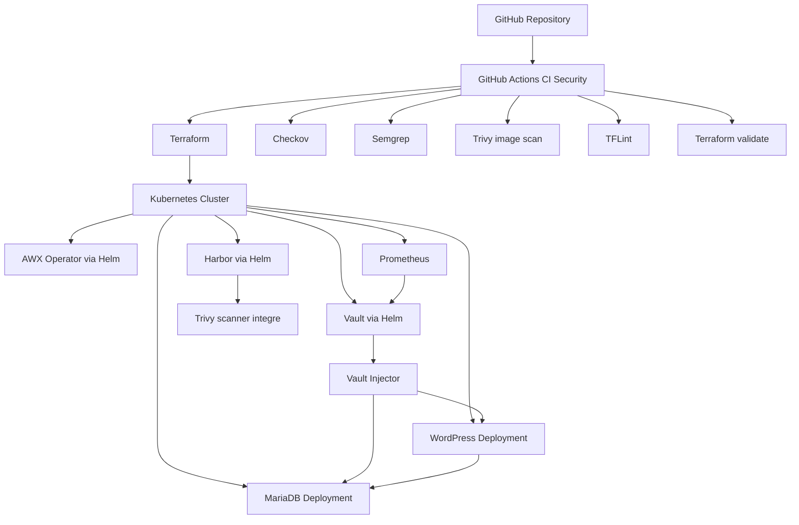

# Vault Terraform GitHub Actions Securisee

Ce projet met en place une plateforme Kubernetes securisee autour de HashiCorp Vault, deploie plusieurs composants d'infrastructure via Terraform et automatise les controles de securite avec GitHub Actions.

L'objectif est de demontrer une chaine DevSecOps complete dans laquelle :

- Terraform orchestre le deploiement des composants d'infrastructure.
- Vault centralise les secrets et les injecte dynamiquement dans les workloads Kubernetes.
- GitHub Actions execute des controles IaC, SAST, CVE et des analyses de surface d'exposition.
- AWX, Harbor, WordPress, MariaDB et Prometheus s'integrent dans une architecture orientee securite et observabilite.

## Sommaire

- [Vue d'ensemble](#vue-densemble)
- [Objectifs du projet](#objectifs-du-projet)
- [Architecture technique](#architecture-technique)
- [Schéma d'architecture](#schema-darchitecture)
- [Composants du projet](#composants-du-projet)
- [Structure du depot](#structure-du-depot)
- [Flux de deploiement](#flux-de-deploiement)
- [Pipeline GitHub Actions](#pipeline-github-actions)
- [Gestion des secrets avec Vault](#gestion-des-secrets-avec-vault)
- [Observabilite et controles de securite](#observabilite-et-controles-de-securite)
- [Prerequis](#prerequis)
- [Guide d'utilisation](#guide-dutilisation)
- [Points d'attention](#points-dattention)
- [Axes d'amelioration](#axes-damelioration)
- [Documentation detaillee](#documentation-detaillee)

## Vue d'ensemble

Le depot assemble plusieurs briques complementaires :

- `terraform/` deploie Vault, AWX et Harbor dans Kubernetes a l'aide des providers Terraform `kubernetes` et `helm`.
- `vault/policies/`, `wordpress/policies/` et `postgres/policies/` definissent les autorisations de lecture des secrets dans Vault.
- `wordpress/wordpress-mariadb.yaml` deploie une application WordPress et sa base MariaDB en s'appuyant sur l'injection de secrets Vault.
- `monitoring/prometheus-values.yaml` prepare le scraping des metriques Vault par Prometheus.
- `.github/workflows/ci-security.yaml` automatise les verifications de securite a chaque push sur `main`.
- `ZAP_baseline/` conserve des rapports de scan OWASP ZAP sur AWX.

En pratique, le projet couvre a la fois le provisionnement, la gestion secrete, le deploiement applicatif et la validation securitaire.

## Objectifs du projet

Ce projet repond a quatre objectifs principaux :

1. Industrialiser le deploiement de services Kubernetes avec Terraform et Helm.
2. Externaliser les secrets applicatifs dans Vault plutot que de les stocker en clair dans les manifests.
3. Mettre en place une chaine CI focalisee sur la securite.
4. Documenter une architecture reproductible de type DevSecOps / platform engineering.

## Architecture technique

L'architecture repose sur un cluster Kubernetes cible, pilote par Terraform.

- Vault est deploie via Helm en mode Raft avec stockage persistant.
- L'injecteur Vault Kubernetes ajoute les secrets dans les pods via annotations.
- AWX est deploie via le chart `awx-operator`.
- Harbor est deploie via Helm avec persistance et scanner Trivy integre.
- WordPress et MariaDB consomment des secrets Vault injectes au demarrage.
- Prometheus interroge l'endpoint de metriques de Vault.
- GitHub Actions controle la qualite et la securite du code et des artefacts.

## Schema d'architecture



Une version detaillee, avec flux logiques et cycle de vie des secrets, est disponible dans [docs/ARCHITECTURE.md](/root/01_Vault/docs/ARCHITECTURE.md).

## Composants du projet

### 1. Terraform

Terraform constitue la couche d'orchestration du projet.

Fichiers principaux :

- [terraform/providers.tf](/root/01_Vault/terraform/providers.tf)
- [terraform/variables.tf](/root/01_Vault/terraform/variables.tf)
- [terraform/namespace.tf](/root/01_Vault/terraform/namespace.tf)
- [terraform/vault.tf](/root/01_Vault/terraform/vault.tf)
- [terraform/awx.tf](/root/01_Vault/terraform/awx.tf)
- [terraform/harbor.tf](/root/01_Vault/terraform/harbor.tf)

Ce que fait Terraform ici :

- configure l'acces au cluster via le `kubeconfig`
- cree les namespaces Kubernetes necessaires
- deploie les charts Helm de Vault, AWX et Harbor
- injecte des valeurs personnalisees a travers des fichiers YAML

### 2. Vault

Vault est le coeur de la gestion des secrets.

Configuration notable :

- chart officiel HashiCorp
- mode `ha` active avec backend `raft`
- `replicas: 1` dans l'etat actuel
- stockage persistant pour les donnees et les logs d'audit
- interface UI activee
- TLS desactive dans la configuration actuelle
- endpoint de metriques expose pour Prometheus

Fichiers concernes :

- [terraform/vault.tf](/root/01_Vault/terraform/vault.tf)
- [terraform/value-vault.yaml](/root/01_Vault/terraform/value-vault.yaml)
- [vault/policies/awx-policy.hcl](/root/01_Vault/vault/policies/awx-policy.hcl)

### 3. AWX

AWX fournit une couche d'automatisation et d'orchestration Ansible.

Caracteristiques visibles dans le depot :

- deploiement via `awx-operator`
- exposition en `NodePort`
- pas d'ingress defini dans les valeurs actuelles

Fichiers concernes :

- [terraform/awx.tf](/root/01_Vault/terraform/awx.tf)
- [terraform/awx-values.yaml](/root/01_Vault/terraform/awx-values.yaml)

### 4. Harbor

Harbor joue le role de registre d'images prive avec scanner integre.

Configuration visible :

- exposition `NodePort`
- persistance activee
- composant Trivy active
- Notary desactive

Fichiers concernes :

- [terraform/harbor.tf](/root/01_Vault/terraform/harbor.tf)
- [terraform/harbor-values.yaml](/root/01_Vault/terraform/harbor-values.yaml)

### 5. WordPress et MariaDB

La partie applicative demontre l'injection des secrets Vault dans des pods Kubernetes.

Le manifest :

- cree le namespace `wordpress`
- cree des `ServiceAccount` dedies
- deploie MariaDB avec credentials injectes par Vault
- deploie WordPress avec variables de connexion a la base injectees par Vault

Fichier principal :

- [wordpress/wordpress-mariadb.yaml](/root/01_Vault/wordpress/wordpress-mariadb.yaml)

Policies associees :

- [wordpress/policies/wordpress-policy.hcl](/root/01_Vault/wordpress/policies/wordpress-policy.hcl)
- [postgres/policies/postgres-policy.hcl](/root/01_Vault/postgres/policies/postgres-policy.hcl)

### 6. Monitoring

Prometheus est configure pour scruter les metriques Vault.

Fichier :

- [monitoring/prometheus-values.yaml](/root/01_Vault/monitoring/prometheus-values.yaml)

L'endpoint surveille est `/v1/sys/metrics` sur le service `vault.vault.svc.cluster.local:8200`.

## Structure du depot

```text
.
|-- .github/
|   `-- workflows/
|       `-- ci-security.yaml
|-- monitoring/
|   `-- prometheus-values.yaml
|-- postgres/
|   `-- policies/
|       `-- postgres-policy.hcl
|-- terraform/
|   |-- providers.tf
|   |-- variables.tf
|   |-- namespace.tf
|   |-- vault.tf
|   |-- awx.tf
|   |-- harbor.tf
|   |-- value-vault.yaml
|   |-- awx-values.yaml
|   `-- harbor-values.yaml
|-- vault/
|   `-- policies/
|       `-- awx-policy.hcl
|-- wordpress/
|   |-- policies/
|   |   `-- wordpress-policy.hcl
|   `-- wordpress-mariadb.yaml
`-- ZAP_baseline/
    `-- zap-reports/
```

## Flux de deploiement

Le cycle de deploiement logique est le suivant :

1. Terraform se connecte au cluster Kubernetes via le `kubeconfig`.
2. Les namespaces d'infrastructure sont crees.
3. Vault est deploie via Helm.
4. AWX et Harbor sont deployes via Helm.
5. Les policies Vault sont chargees dans Vault.
6. Les roles Kubernetes/Vault sont relies aux `ServiceAccount`.
7. WordPress et MariaDB sont deployes avec annotations Vault.
8. Au demarrage, l'injecteur Vault monte les secrets dans les pods.
9. Prometheus collecte les metriques Vault.
10. GitHub Actions verifie en continu la securite du depot et de certaines images.

## Pipeline GitHub Actions

Le workflow [`.github/workflows/ci-security.yaml`](/root/01_Vault/.github/workflows/ci-security.yaml) se declenche :

- sur `push` vers `main`
- a la demande avec `workflow_dispatch`

Le pipeline comprend les etapes suivantes :

### Terraform

- `terraform fmt -check -recursive`
- `terraform init -backend=false -input=false`
- `terraform validate -no-color`

### TFLint

- initialisation de TFLint
- scan recursif de la configuration Terraform

### Checkov

- analyse IaC du dossier `terraform`
- export SARIF vers GitHub Security

### Semgrep

- scan SAST du depot
- generation d'un artefact SARIF
- upload vers le dashboard de securite GitHub

### Trivy

- scan d'images conteneur utilisees dans la plateforme
- recherche des vulnerabilites `HIGH` et `CRITICAL`

## Gestion des secrets avec Vault

Le projet illustre une approche saine de separation entre code et secret.

Principe de fonctionnement :

1. L'application declare des annotations `vault.hashicorp.com/...` sur le pod.
2. Le pod utilise un `ServiceAccount` dedie.
3. Vault associe ce `ServiceAccount` a un role Kubernetes.
4. Ce role autorise la lecture d'un chemin precis dans Vault.
5. L'agent Vault injecte un fichier d'environnement dans le conteneur.
6. Le conteneur source ce fichier puis demarre.

Exemples visibles dans le depot :

- `secret/data/wordpress/db` pour la base WordPress
- `secret/data/wordpress/admin` pour l'administration WordPress
- `secret/data/awx/config` pour AWX
- `secret/data/postgres` pour Postgres

## Observabilite et controles de securite

Le projet inclut plusieurs niveaux de controle :

- controle de qualite Terraform avec `fmt`, `validate` et `tflint`
- scan IaC avec Checkov
- scan SAST avec Semgrep
- scan CVE de conteneurs avec Trivy
- scan web OWASP ZAP pour AWX
- metriques Vault exportees vers Prometheus

Le rapport ZAP versionne dans `ZAP_baseline/zap-reports/awx-zap-report.md` fait notamment apparaitre :

- 1 alerte de niveau `High`
- 5 alertes de niveau `Medium`
- 5 alertes de niveau `Low`
- 5 alertes informatives

## Prerequis

Pour reproduire le projet dans un environnement equivalent, il faut au minimum :

- un cluster Kubernetes accessible
- un `kubeconfig` valide
- Terraform
- Helm
- `kubectl`
- Vault CLI pour charger policies et roles
- un compte GitHub avec Actions activees

## Guide d'utilisation

### 1. Initialiser Terraform

```bash
cd terraform
terraform init
terraform fmt -recursive
terraform validate
```

### 2. Planifier puis appliquer l'infrastructure

```bash
terraform plan
terraform apply
```

### 3. Charger les policies Vault

Exemple de logique attendue :

```bash
vault policy write awx vault/policies/awx-policy.hcl
vault policy write wordpress wordpress/policies/wordpress-policy.hcl
vault policy write postgres postgres/policies/postgres-policy.hcl
```

### 4. Deployer WordPress et MariaDB

```bash
kubectl apply -f wordpress/wordpress-mariadb.yaml
```

### 5. Activer le scraping Prometheus

Le fichier de valeurs [monitoring/prometheus-values.yaml](/root/01_Vault/monitoring/prometheus-values.yaml) doit etre integre au chart ou au release Prometheus utilise dans votre cluster.

## Points d'attention

La documentation doit aussi refleter l'etat reel du depot. Voici donc les points importants a connaitre dans la configuration actuelle :

- Vault est configure avec `tlsDisable: true` et `tls_disable = 1`, ce qui convient a un lab mais pas a une production.
- Vault est configure en mode HA Raft mais avec un seul replica, ce qui limite la haute disponibilite effective.
- AWX et Harbor sont exposes en `NodePort`, sans couche d'ingress ni terminaison TLS dans le depot.
- Le mot de passe admin Harbor est present en clair dans [terraform/harbor-values.yaml](/root/01_Vault/terraform/harbor-values.yaml).
- Le rapport ZAP montre encore des faiblesses sur l'instance AWX analysee.
- Le workflow Trivy contient actuellement une etape qui reference `IMAGE_TO_SCAN` alors que les variables definies sont `IMAGE_TO_SCAN01` a `IMAGE_TO_SCAN08`.

## Axes d'amelioration

Pour faire evoluer ce projet vers un niveau plus proche de la production :

1. Activer TLS de bout en bout pour Vault, Harbor et AWX.
2. Remplacer les `NodePort` par un Ingress Controller securise.
3. Externaliser tous les secrets statiques hors des fichiers de valeurs.
4. Ajouter des `NetworkPolicy` Kubernetes.
5. Completer la chaine de signature et de verification d'images avec Cosign.
6. Introduire une gestion de state Terraform distante et chiffree.
7. Ajouter des environnements GitHub distincts pour `dev`, `staging` et `prod`.
8. Industrialiser le bootstrap Vault avec auth methods, roles et secret engines versionnes.

## Documentation detaillee

Pour une vue plus approfondie des composants, des flux de secrets et des schemas d'architecture, consulter :

- [docs/ARCHITECTURE.md](/root/01_Vault/docs/ARCHITECTURE.md)
