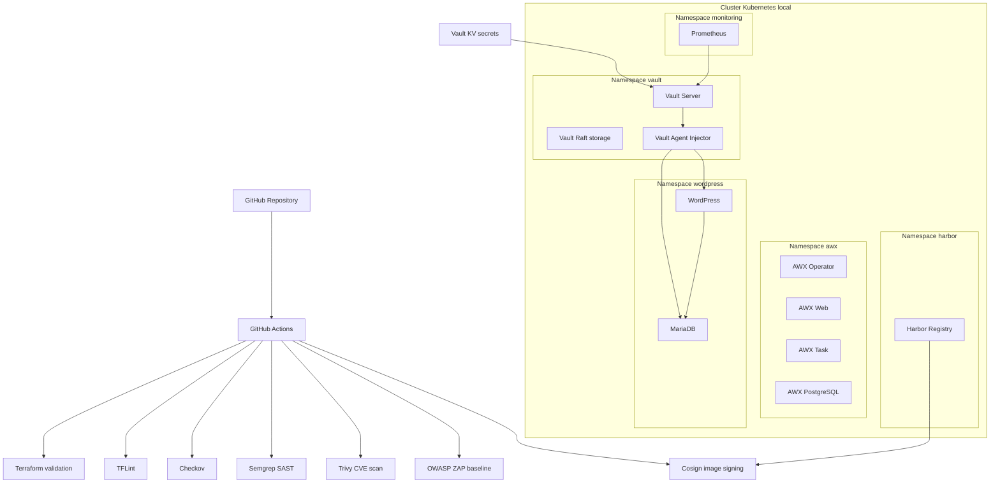
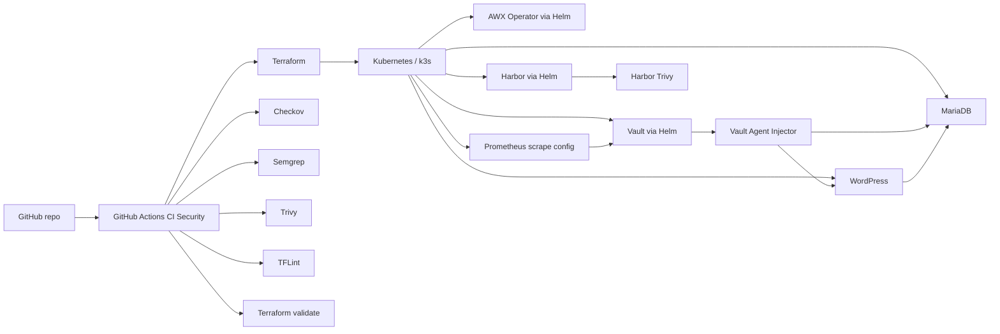
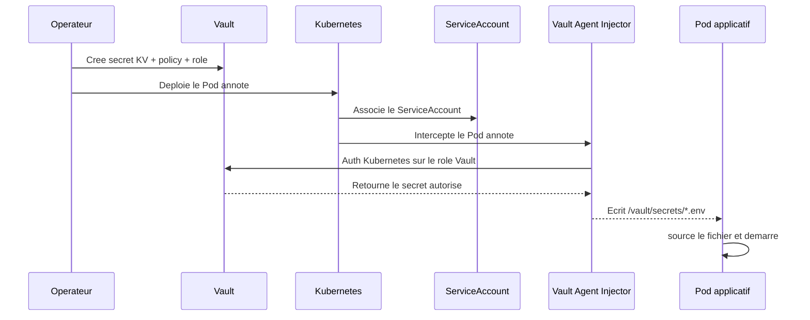

# Vault + Terraform + GitHub Actions CI securisee

Ce depot documente un lab DevSecOps Kubernetes centre sur Vault, Terraform, GitHub Actions, Harbor, AWX, WordPress et Prometheus.

Le but du projet est de montrer une chaine complete allant de l'Infrastructure as Code jusqu'a l'execution applicative securisee :

- provisionnement Kubernetes avec Terraform + Helm
- gestion centralisee des secrets avec Vault KV
- injection de secrets dans les Pods via Vault Agent Injector
- supervision de Vault avec Prometheus
- registry prive avec Harbor
- signature d'image avec Cosign
- scans de securite CI/CD avec TFLint, Checkov, Semgrep, Trivy et ZAP baseline
- socle d'automatisation Ansible avec AWX

## Contexte du lab

Support de reference :

- [Lab DevSecOps Kubernetes.pdf](/mnt/c/Users/Robin/Downloads/Lab%20DevSecOps%20Kubernetes.pdf)

Cadre pedagogique du TP :

- duree cible : `~8h`
- socle technique : `k3s + GitHub`
- CI/CD attendu : `tflint`, `checkov`, `Semgrep`, `Trivy`, `ZAP baseline`, `Cosign`, `Harbor`
- IaC : `Terraform (k3s + Vault Helm)`
- observabilite : `Prometheus` + `vault-exporter` / metriques Vault

## Objectif

Deployer Vault sur Kubernetes via Terraform + Helm, puis demontrer :

1. le stockage centralise des secrets dans Vault KV
2. l'authentification Kubernetes vers Vault
3. l'injection runtime des secrets dans les Pods
4. l'utilisation des secrets par une application reelle `WordPress + MariaDB`
5. la supervision de Vault avec Prometheus
6. une pipeline GitHub Actions de controles DevSecOps
7. un registry prive Harbor avec signature d'image Cosign
8. l'integration d'AWX comme brique d'automatisation

## Sommaire

- [Architecture cible](#architecture-cible)
- [Architecture du depot](#architecture-du-depot)
- [Etat reel du depot](#etat-reel-du-depot)
- [Parcours du lab](#parcours-du-lab)
- [Composants](#composants)
- [Flux des secrets](#flux-des-secrets)
- [Pipeline GitHub Actions](#pipeline-github-actions)
- [Verification fonctionnelle](#verification-fonctionnelle)
- [Structure du depot](#structure-du-depot)
- [Guide d'utilisation](#guide-dutilisation)
- [Points de securite](#points-de-securite)
- [Ameliorations recommandees](#ameliorations-recommandees)
- [Documentation detaillee](#documentation-detaillee)

## Architecture cible

Le support du lab decrit l'architecture logique suivante :



## Architecture du depot

Le depot versionne actuellement les briques suivantes :

- Terraform pour deployer `Vault`, `AWX` et `Harbor`
- policies Vault pour `AWX`, `WordPress` et `Postgres`
- manifest Kubernetes `WordPress + MariaDB` avec injection Vault
- configuration Prometheus pour scruter Vault
- workflow GitHub Actions de securite
- rapports ZAP baseline
- materiel Cosign

Le schema ci-dessous represente l'architecture effectivement visible dans le depot :



## Etat reel du depot

Cette section est importante pour distinguer le resultat attendu par le lab et ce qui est deja present dans le repository.

### Deja implemente dans le depot

- deploiement Terraform de `Vault`, `AWX` et `Harbor`
- configuration Vault en `Raft` avec stockage persistant
- `Vault Agent Injector` active
- policies Vault pour plusieurs usages
- manifest `WordPress + MariaDB` avec secrets injectes depuis Vault
- configuration Prometheus pour les metriques Vault
- workflow GitHub Actions avec `Terraform`, `TFLint`, `Checkov`, `Semgrep` et `Trivy`
- rapports `OWASP ZAP baseline` versionnes en local
- cle publique Cosign et materiel de signature present

### Attendues par le lab mais non completement automatisees dans le depot

- etape `ZAP baseline` integree directement dans le workflow GitHub Actions
- etape `Cosign sign` integree directement dans le workflow GitHub Actions
- workflow complet de push signe vers Harbor
- deploiement explicite de Prometheus dans Terraform
- `vault-exporter` en tant que composant distinct
- bootstrap complet Vault `auth method + roles + secrets` code et versionne

### Point d'honnetete technique

La documentation ci-dessous suit le cadrage du lab, mais les sections "etat reel" et "points d'attention" indiquent clairement ce qui est :

- deja present dans le code
- partiellement present
- encore attendu pour une couverture complete du TP

## Parcours du lab

Le support de lab decoupe le projet en 4 etapes principales.

### Etape 1. IaC Vault

Objectif :

- module Terraform pour `k3s + Vault Helm`
- variables Terraform
- validation locale `tflint + checkov`

Livrables associes dans le depot :

- [terraform/providers.tf](/root/01_Vault/terraform/providers.tf)
- [terraform/variables.tf](/root/01_Vault/terraform/variables.tf)
- [terraform/namespace.tf](/root/01_Vault/terraform/namespace.tf)
- [terraform/vault.tf](/root/01_Vault/terraform/vault.tf)
- [terraform/value-vault.yaml](/root/01_Vault/terraform/value-vault.yaml)

### Etape 2. Pipeline GitHub Actions

Objectif :

- `tflint`
- `checkov`
- `Semgrep`
- `Trivy`
- pipeline bloquante sur les controles critiques

Livrable principal :

- [.github/workflows/ci-security.yaml](/root/01_Vault/.github/workflows/ci-security.yaml)

### Etape 3. DAST, signature et registry

Objectif :

- `ZAP baseline` sur l'application exposee
- signature d'image `Cosign`
- push dans `Harbor`

Elements presents dans le depot :

- [ZAP_baseline/zap-reports/awx-zap-report.md](/root/01_Vault/ZAP_baseline/zap-reports/awx-zap-report.md)
- [terraform/harbor.tf](/root/01_Vault/terraform/harbor.tf)
- [terraform/harbor-values.yaml](/root/01_Vault/terraform/harbor-values.yaml)
- [cosign/awx-operator.pub](/root/01_Vault/cosign/awx-operator.pub)

### Etape 4. Secrets et observabilite

Objectif :

- `Vault KV`
- `Vault Agent Injector`
- `Prometheus dashboard`

Livrables associes :

- [wordpress/wordpress-mariadb.yaml](/root/01_Vault/wordpress/wordpress-mariadb.yaml)
- [monitoring/prometheus-values.yaml](/root/01_Vault/monitoring/prometheus-values.yaml)
- [wordpress/policies/wordpress-policy.hcl](/root/01_Vault/wordpress/policies/wordpress-policy.hcl)

## Composants

### Vault

Vault est la piece centrale du lab.

Le depot montre une installation Vault via Helm avec :

- namespace dedie `vault`
- `Raft` comme backend de stockage
- persistance des donnees et des logs d'audit
- `Vault Agent Injector` active
- interface `UI` activee
- telemetrie Prometheus exposee
- mode `HA` active avec `1` replica dans le contexte du lab local

Fichiers :

- [terraform/vault.tf](/root/01_Vault/terraform/vault.tf)
- [terraform/value-vault.yaml](/root/01_Vault/terraform/value-vault.yaml)

### Terraform

Terraform sert de couche de provisionnement.

Il :

- configure l'acces Kubernetes via `kubeconfig`
- cree les namespaces
- deploie les charts Helm
- centralise les parametres dans des fichiers de valeurs YAML

Fichiers :

- [terraform/providers.tf](/root/01_Vault/terraform/providers.tf)
- [terraform/variables.tf](/root/01_Vault/terraform/variables.tf)
- [terraform/namespace.tf](/root/01_Vault/terraform/namespace.tf)
- [terraform/awx.tf](/root/01_Vault/terraform/awx.tf)
- [terraform/harbor.tf](/root/01_Vault/terraform/harbor.tf)

### WordPress + MariaDB

Cette partie constitue le cas d'usage applicatif principal du lab.

L'idee est de montrer qu'une application reelle peut :

- recuperer ses credentials depuis Vault
- demarrer sans secret en clair dans le manifest
- initialiser la base avec des variables injectees a l'execution

Fichier :

- [wordpress/wordpress-mariadb.yaml](/root/01_Vault/wordpress/wordpress-mariadb.yaml)

### Harbor

Harbor joue le role de registry prive local.

Le lab l'utilise pour :

- stocker des images internes
- preparer la signature Cosign
- demontrer la maitrise de la supply chain

Fichiers :

- [terraform/harbor.tf](/root/01_Vault/terraform/harbor.tf)
- [terraform/harbor-values.yaml](/root/01_Vault/terraform/harbor-values.yaml)

### AWX

AWX apporte la brique d'automatisation Ansible.

Dans le lab, il sert de point d'extension vers :

- des playbooks Ansible
- des credentials lus dans Vault
- une plateforme d'orchestration securisee

Fichiers :

- [terraform/awx.tf](/root/01_Vault/terraform/awx.tf)
- [terraform/awx-values.yaml](/root/01_Vault/terraform/awx-values.yaml)
- [vault/policies/awx-policy.hcl](/root/01_Vault/vault/policies/awx-policy.hcl)

### Prometheus

Prometheus sert ici a la supervision de Vault.

Les metriques d'interet mentionnees par le lab sont notamment :

- `up{job="vault"}`
- `vault_core_active`
- `vault_core_unsealed`
- `vault_autopilot_healthy`
- `vault_expire_num_leases`

Fichier :

- [monitoring/prometheus-values.yaml](/root/01_Vault/monitoring/prometheus-values.yaml)

## Flux des secrets

Le coeur du projet est le chemin suivi par un secret depuis Vault jusqu'au conteneur applicatif.



### Secret WordPress

Le support du lab decrit ce secret comme source principale :

- `secret/wordpress/db`

Et dans les policies Vault, le chemin API correspondant devient :

- `secret/data/wordpress/db`

Le manifest WordPress / MariaDB de ce depot suit bien ce modele.

### Roles Kubernetes Auth

Le lab s'appuie sur deux roles Vault distincts :

- `wordpress-db`
- `wordpress-app`

Ils sont relies aux `ServiceAccount` Kubernetes du namespace `wordpress` afin de limiter les acces au strict necessaire.

## Pipeline GitHub Actions

Le workflow [`.github/workflows/ci-security.yaml`](/root/01_Vault/.github/workflows/ci-security.yaml) couvre actuellement :

- `terraform fmt`
- `terraform init`
- `terraform validate`
- `TFLint`
- `Checkov`
- `Semgrep`
- `Trivy`

### Ce que le lab vise

La cible pedagogique du lab est une pipeline DevSecOps avec :

- `lint`
- `IaC scan`
- `SAST`
- `CVE scan`
- `DAST`
- `image signing`

### Ce qui manque encore pour une couverture totale

- une etape `OWASP ZAP baseline` dans GitHub Actions
- une etape `Cosign sign` dans GitHub Actions
- une logique explicite de publication vers Harbor depuis la CI

## Verification fonctionnelle

Le support du lab propose plusieurs verifications. Elles sont utiles a reprendre dans la documentation d'exploitation.

### Verifier la mutation des Pods

Resultat attendu :

- `vault-agent-init` present comme `initContainer`
- conteneur applicatif principal present ensuite

Exemples de commandes :

```bash
DB_POD=$(kubectl get pod -n wordpress -l app=wordpress-mariadb -o jsonpath='{.items[0].metadata.name}')
WP_POD=$(kubectl get pod -n wordpress -l app=wordpress -o jsonpath='{.items[0].metadata.name}')

kubectl get pod -n wordpress "$WP_POD" \
  -o jsonpath='{.spec.initContainers[*].name}{"\n"}{.spec.containers[*].name}{"\n"}'

kubectl get pod -n wordpress "$DB_POD" \
  -o jsonpath='{.spec.initContainers[*].name}{"\n"}{.spec.containers[*].name}{"\n"}'
```

### Verifier la connexion MariaDB

```bash
kubectl exec -n wordpress "$DB_POD" -c mariadb -- sh -c '
  . /vault/secrets/db.env
  mariadb -h 127.0.0.1 \
    -u"$MARIADB_USER" \
    -p"$MARIADB_PASSWORD" \
    "$MARIADB_DATABASE" \
    -e "SELECT DATABASE();"
'
```

### Verifier les tables WordPress

```bash
kubectl exec -n wordpress "$DB_POD" -c mariadb -- sh -c '
  . /vault/secrets/db.env
  mariadb -h 127.0.0.1 \
    -u"$MARIADB_USER" \
    -p"$MARIADB_PASSWORD" \
    "$MARIADB_DATABASE" \
    -e "SHOW TABLES;"
'
```

### Verifier les metriques Vault

PromQL utiles :

- `up{job="vault"}`
- `vault_core_unsealed`
- `vault_core_active`
- `vault_autopilot_healthy`

## Structure du depot

```text
.
|-- .github/
|   `-- workflows/
|       `-- ci-security.yaml
|-- cosign/
|   `-- awx-operator.pub
|-- docs/
|   `-- ARCHITECTURE.md
|-- monitoring/
|   `-- prometheus-values.yaml
|-- postgres/
|   `-- policies/
|       `-- postgres-policy.hcl
|-- terraform/
|   |-- providers.tf
|   |-- variables.tf
|   |-- namespace.tf
|   |-- vault.tf
|   |-- awx.tf
|   |-- harbor.tf
|   |-- value-vault.yaml
|   |-- awx-values.yaml
|   `-- harbor-values.yaml
|-- vault/
|   `-- policies/
|       `-- awx-policy.hcl
|-- wordpress/
|   |-- policies/
|   |   `-- wordpress-policy.hcl
|   `-- wordpress-mariadb.yaml
`-- ZAP_baseline/
    `-- zap-reports/
```

## Guide d'utilisation

### 1. Initialiser Terraform

```bash
cd terraform
terraform init
terraform fmt -recursive
terraform validate
```

### 2. Deployer l'infrastructure

```bash
terraform plan
terraform apply
```

### 3. Charger les policies Vault

```bash
vault policy write awx vault/policies/awx-policy.hcl
vault policy write wordpress wordpress/policies/wordpress-policy.hcl
vault policy write postgres postgres/policies/postgres-policy.hcl
```

### 4. Deployer WordPress et MariaDB

```bash
kubectl apply -f wordpress/wordpress-mariadb.yaml
```

### 5. Integrer la configuration Prometheus

La configuration [monitoring/prometheus-values.yaml](/root/01_Vault/monitoring/prometheus-values.yaml) doit etre ajoutee au deploiement Prometheus du cluster.

## Points de securite

Le PDF insiste sur plusieurs bonnes pratiques. Elles sont pertinentes pour ce depot.

### A ne jamais committer

- `VAULT_TOKEN`
- `unseal keys`
- `root token`
- mots de passe applicatifs
- cles privees Cosign
- fichiers `.env`
- rapports contenant des donnees sensibles

### Etat sensible observe dans le depot

- le mot de passe admin Harbor est present en clair dans [terraform/harbor-values.yaml](/root/01_Vault/terraform/harbor-values.yaml)
- Vault est configure sans TLS pour rester compatible avec un lab local
- Vault est en `HA` logique mais avec une seule replique
- AWX et Harbor sont exposes en `NodePort`
- le workflow Trivy contient une reference a `IMAGE_TO_SCAN` alors que les variables declarees sont `IMAGE_TO_SCAN01` a `IMAGE_TO_SCAN08`

### Recommandation de separation des acces

Le support recommande de distinguer au minimum :

- une policy `runtime` pour les credentials techniques
- une policy `admin` pour les credentials humains
- une policy `AWX` pour les futurs besoins Ansible

## Ameliorations recommandees

Pour finir pleinement le lab et rapprocher le projet d'une implementation de production :

1. Ajouter `ZAP baseline` dans le workflow GitHub Actions.
2. Ajouter `Cosign sign` dans le workflow GitHub Actions.
3. Ajouter le push CI des images vers Harbor.
4. Automatiser le bootstrap complet de Vault `auth/kubernetes`, roles et secrets.
5. Deployer Prometheus ou `vault-exporter` dans Terraform.
6. Activer TLS sur Vault, Harbor et AWX.
7. Remplacer `NodePort` par un Ingress Controller securise.
8. Externaliser tous les secrets statiques hors des fichiers versionnes.
9. Ajouter des `NetworkPolicy`.
10. Mettre le state Terraform dans un backend distant securise.

## Documentation detaillee

Pour la vue architecture plus poussee, consulter :

- [docs/ARCHITECTURE.md](/root/01_Vault/docs/ARCHITECTURE.md)
