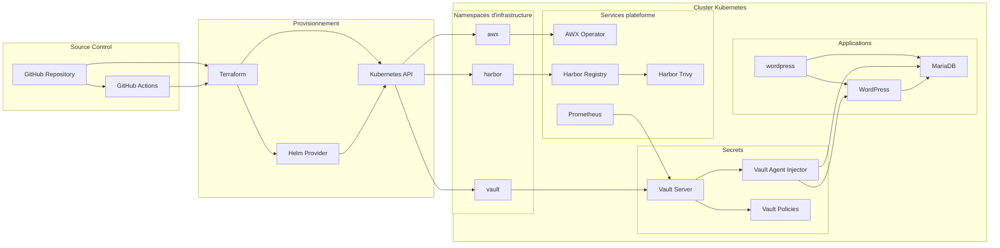
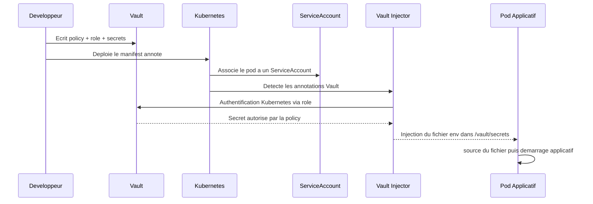
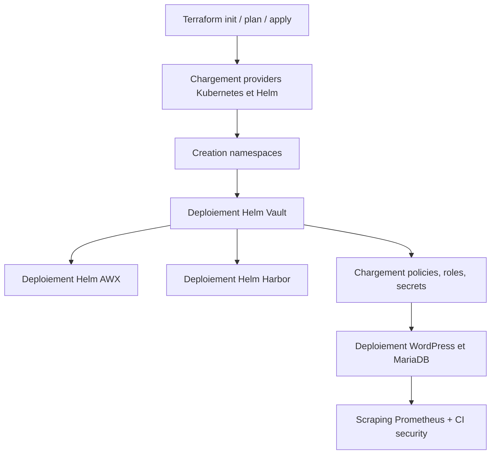
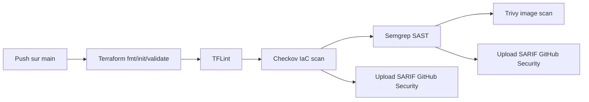

# Architecture detaillee

Ce document decrit l'architecture du projet au niveau systeme, les dependances entre composants et le chemin suivi par les secrets depuis Vault jusqu'aux applications.

## 1. Vision globale

Le projet s'appuie sur un socle Kubernetes pilote par Terraform et securise par une chaine CI GitHub Actions.

## 2. Roles des composants

### Terraform

Terraform est la couche declarative principale. Il :

- configure les providers `kubernetes` et `helm`
- cree des namespaces cibles
- deploie les releases Helm de Vault, Harbor et AWX
- centralise les valeurs de parametrage dans des fichiers YAML

### Vault

Vault fournit :

- le stockage des secrets applicatifs
- les policies d'autorisation
- l'integration Kubernetes via l'Injector
- les metriques d'exploitation exposees a Prometheus

Dans ce projet, Vault est configure en mode Raft persistant, avec l'UI activee et les metriques Prometheus accessibles.

### AWX

AWX sert de brique d'automatisation. Son deploiement via `awx-operator` permet d'illustrer l'integration d'un composant d'orchestration dans une plateforme securisee.

### Harbor

Harbor apporte :

- un registre prive d'images
- la persistence des artefacts
- un scanner Trivy integre

Il couvre donc la partie supply chain et cycle de vie des images.

### WordPress et MariaDB

Cet ensemble sert de cas d'usage applicatif concret :

- MariaDB consomme ses identifiants depuis Vault
- WordPress consomme la configuration d'acces a la base depuis Vault
- l'application ne porte pas ses secrets dans le manifest

### Prometheus

Prometheus est configure pour interroger l'endpoint metrique de Vault, ce qui permet de superviser l'etat du service de secrets.

### GitHub Actions

GitHub Actions forme la couche de controle de securite continue. Le pipeline effectue :

- des verifications de structure Terraform
- du lint Terraform
- de l'analyse IaC
- de l'analyse SAST
- du scan d'images

## 3. Architecture des secrets

Le flux de secret est l'un des points les plus importants du projet.

### Exemple concret WordPress

Pour `wordpress-mariadb.yaml`, le mecanisme est le suivant :

1. `wordpress-db` lit `secret/data/wordpress/db`.
2. L'agent Vault genere un fichier `db.env`.
3. Le conteneur MariaDB source ce fichier avant de lancer `mariadbd`.
4. `wordpress-app` lit le meme secret pour construire les variables `WORDPRESS_DB_*`.
5. Le conteneur WordPress source `wp.env` puis demarre Apache.

Cette approche evite de stocker les mots de passe dans les variables d'environnement Kubernetes statiques ou dans les manifests versionnes.

## 4. Flux de provisionnement

## 5. Architecture du pipeline CI securite

### Lecture du workflow

Le pipeline ne deploie pas directement l'infrastructure. Il agit comme garde-fou de securite et de qualite.

Sa valeur ajoutee tient dans le fait qu'il combine :

- validation syntaxique et semantique Terraform
- detection de mauvaises pratiques IaC
- analyse de patterns de code dangereux
- analyse de vulnerabilites sur des images externes consommees par la plateforme

## 6. Mapping entre fichiers et responsabilites

| Zone | Fichiers | Responsabilite |
| --- | --- | --- |
| Terraform core | `terraform/providers.tf`, `terraform/variables.tf` | connexion au cluster et parametrage |
| Namespaces | `terraform/namespace.tf`, `terraform/awx.tf` | isolation logique des composants |
| Vault | `terraform/vault.tf`, `terraform/value-vault.yaml` | service de secrets et injecteur |
| AWX | `terraform/awx.tf`, `terraform/awx-values.yaml` | automatisation / operations |
| Harbor | `terraform/harbor.tf`, `terraform/harbor-values.yaml` | registre prive d'images |
| App demo | `wordpress/wordpress-mariadb.yaml` | preuve de fonctionnement de l'injection Vault |
| Policies | `vault/policies/*.hcl`, `wordpress/policies/*.hcl`, `postgres/policies/*.hcl` | controle d'acces aux secrets |
| Monitoring | `monitoring/prometheus-values.yaml` | collecte des metriques Vault |
| Security reports | `.github/workflows/ci-security.yaml`, `ZAP_baseline/zap-reports/*` | validation continue de securite |

## 7. Hypotheses d'exploitation

Le depot montre clairement une architecture de laboratoire avance ou de POC securise. Plusieurs indices vont dans ce sens :

- exposition de services en `NodePort`
- TLS desactive pour Vault
- replica unique pour Vault en mode Raft
- stockage local des valeurs d'environnement et manifests de demonstration

Cela ne retire rien a la qualite pedagogique du projet. Au contraire, l'ensemble est tres pertinent pour montrer comment articuler :

- Terraform
- Kubernetes
- Vault Injector
- policies de moindre privilege
- scans CI de securite

## 8. Recommandations d'architecture

Pour pousser cette architecture vers un niveau enterprise, la trajectoire recommandee serait :

1. Activer TLS pour Vault, Harbor, AWX et les endpoints d'administration.
2. Remplacer `NodePort` par un Ingress Controller avec certificats et politiques d'acces.
3. Ajouter des `NetworkPolicy` entre namespaces.
4. Basculer le state Terraform vers un backend distant securise.
5. Automatiser le bootstrap Vault avec une procedure idempotente.
6. Introduire des environnements distincts et des variables separees par contexte.
7. Coupler Harbor, Cosign et des politiques d'admission pour controler les images admises dans le cluster.

## 9. Conclusion

Le projet met en scene une architecture coherente de plateforme securisee :

- provisionnement par Terraform
- gestion des secrets par Vault
- consommation dynamique des secrets par les applications
- supervision initiale avec Prometheus
- defense continue via GitHub Actions

La combinaison de ces briques donne une base solide pour un projet de demonstration, de soutenance, de portfolio technique ou de socle d'industrialisation a faire monter en maturite.
