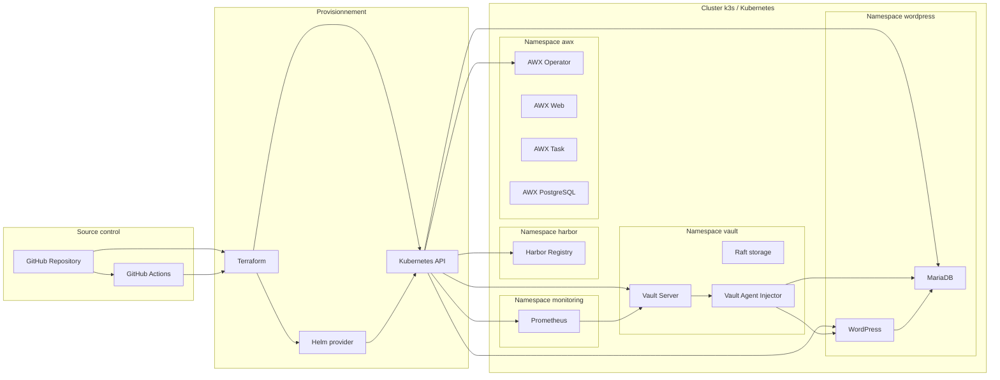
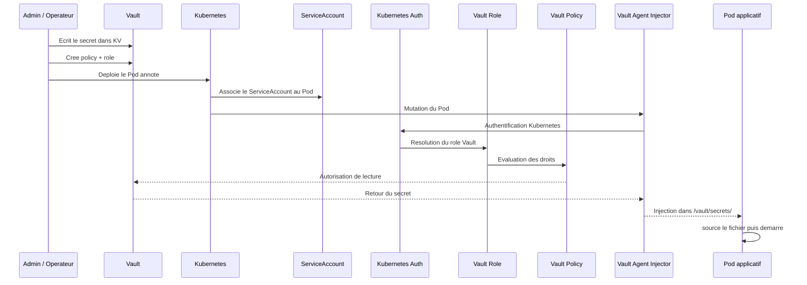
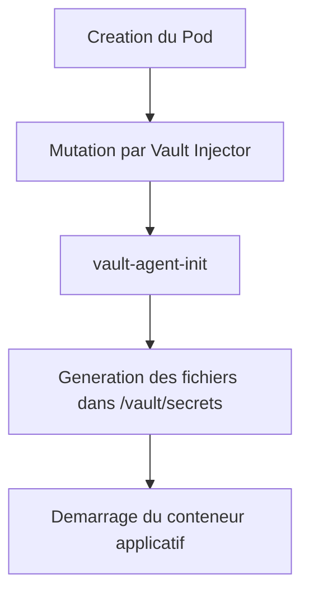
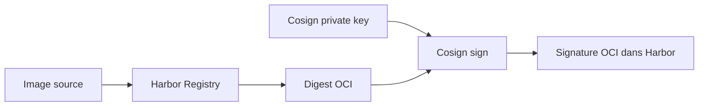

# Architecture detaillee du lab

Ce document reprend le cadrage du support "Lab DevSecOps Kubernetes" et l'aligne sur le contenu reel du depot.

## 1. Positionnement

Le projet illustre une chaine DevSecOps Kubernetes complete autour de Vault.

Le fil conducteur du lab est le suivant :

- Terraform deploie l'infrastructure
- Vault stocke les secrets
- Kubernetes Auth permet aux Pods de s'authentifier
- Vault Agent Injector injecte les secrets a l'execution
- WordPress et MariaDB consomment ces secrets
- Prometheus supervise Vault
- Harbor stocke les images
- Cosign signe les images
- AWX sert de plateforme d'automatisation
- GitHub Actions applique les controles de securite

## 2. Vue systeme

## 3. Architecture des secrets

La partie la plus importante du lab est la circulation du secret.

### Sequence logique du lab

Le support de reference decrit exactement ce chemin :

1. un secret est stocke dans `Vault KV`
2. un Pod Kubernetes est annote pour l'injection
3. le `ServiceAccount` du Pod s'authentifie via `Kubernetes Auth`
4. Vault applique un `role`
5. le role applique une `policy`
6. le secret autorise est ecrit dans `/vault/secrets/`
7. le conteneur source le fichier puis demarre

## 4. Vault

Le deploiement Vault du lab repose sur :

- chart Helm officiel HashiCorp
- namespace dedie `vault`
- persistance des donnees
- backend `Raft`
- UI activee
- telemetrie activee
- Agent Injector active
- mode HA avec une seule replique dans le contexte du lab local

### Pourquoi une seule replique

Le support de lab est explicite sur ce point : le mode `HA` est active, mais le lab reste volontairement sur `1` replique pour rester compatible avec un cluster local mono-node.

### Shamir seal

Le PDF rappelle aussi un point de fonctionnement important :

- `unseal keys` : servent a deverrouiller Vault apres redemarrage
- `root token` : sert a administrer Vault

En production, cette mecanique manuelle devrait etre remplacee par un `auto-unseal` via KMS ou HSM.

## 5. Vault KV et Kubernetes Auth

Le moteur utilise est `KV v2`.

Exemple logique du lab :

- chemin fonctionnel : `secret/wordpress/db`
- chemin policy/API : `secret/data/wordpress/db`

Cette distinction apparait deja dans ce depot, notamment dans :

- [wordpress/policies/wordpress-policy.hcl](/root/01_Vault/wordpress/policies/wordpress-policy.hcl)

Kubernetes Auth permet a un Pod d'obtenir un token Vault a partir de son `ServiceAccount`.

## 6. WordPress + MariaDB

Le cas d'usage principal du lab est une application reelle.

### Intention

Montrer que :

- MariaDB peut etre initialisee avec des credentials injectes par Vault
- WordPress peut se connecter a MariaDB sans stocker ses secrets en clair dans les manifests

### Secret utilise

Le PDF decrit le secret suivant :

- `secret/wordpress/db`

Avec des champs de type :

- `username`
- `password`
- `database`
- `host`
- `port`
- `root_password`

### Mapping sur le depot

Le fichier [wordpress/wordpress-mariadb.yaml](/root/01_Vault/wordpress/wordpress-mariadb.yaml) implemente bien cette logique :

- `wordpress-db` consomme `/vault/secrets/db.env`
- `wordpress-app` consomme `/vault/secrets/wp.env`
- les deux charges sont liees a des `ServiceAccount` dedies

### Roles Vault attendus

Le support de lab formalise deux roles :

- `wordpress-db`
- `wordpress-app`

Cette separation est saine car elle permet de limiter les permissions au besoin reel de chaque Pod.

## 7. Verification de l'injection

Le PDF insiste sur la verification des `initContainers`.

Le resultat attendu est :

- `vault-agent-init`
- puis le conteneur applicatif `wordpress` ou `mariadb`

## 8. Monitoring Vault avec Prometheus

Le lab rappelle un point important : Prometheus ne distribue pas les credentials.

Prometheus sert a superviser Vault.

### Endpoint metrique

Vault expose :

- `/v1/sys/metrics?format=prometheus`

### Configuration visible dans le depot

Le fichier [monitoring/prometheus-values.yaml](/root/01_Vault/monitoring/prometheus-values.yaml) configure bien le scraping du service :

- `vault.vault.svc.cluster.local:8200`

### Requetes utiles

- `up{job="vault"}`
- `vault_core_active`
- `vault_core_unsealed`
- `vault_autopilot_healthy`
- `vault_expire_num_leases`

## 9. Harbor et Cosign

Le support de lab positionne Harbor comme registry prive local et Cosign comme mecanisme de signature par digest.

Le principe cible est le suivant :

Le depot contient :

- la configuration Harbor
- une cle publique Cosign
- des traces montrant que la brique est dans le perimetre du lab

En revanche, l'automatisation CI complete de la signature n'est pas encore materialisee dans le workflow GitHub Actions actuel.

## 10. AWX

Le support du lab decrit AWX comme plateforme d'automatisation Ansible.

Les composants cibles sont :

- `awx-operator-controller-manager`
- `awx-web`
- `awx-task`
- `awx-postgres`

Le depot montre le deploiement via `awx-operator`, ce qui aligne bien l'infrastructure avec l'objectif du lab.

Le PDF propose ensuite deux trajectoires d'integration avec Vault :

1. injection Vault dans les Pods / jobs AWX
2. lecture dynamique de Vault depuis Ansible avec `community.hashi_vault`

La seconde approche est generalement la plus propre pour les playbooks.

## 11. Pipeline CI / DevSecOps

Le support de lab vise une pipeline complete :

- Terraform validation
- TFLint
- Checkov
- Semgrep
- Trivy
- ZAP baseline
- Cosign image signing

### Couverture actuelle du depot

Le workflow [ci-security.yaml](/root/01_Vault/.github/workflows/ci-security.yaml) couvre deja :

- validation Terraform
- TFLint
- Checkov
- Semgrep
- Trivy

Les briques suivantes existent dans le perimetre du projet mais ne sont pas encore totalement branchees a la CI :

- `ZAP baseline`
- `Cosign sign`
- `push Harbor`

## 12. Cartographie depot / objectifs du lab

| Objectif du lab | Etat dans le depot | Reference |
| --- | --- | --- |
| Vault via Terraform + Helm | implemente | `terraform/vault.tf`, `terraform/value-vault.yaml` |
| Kubernetes Auth + Injector | implemente partiellement dans les manifests, bootstrap Vault a finaliser | `wordpress/wordpress-mariadb.yaml`, `wordpress/policies/*.hcl` |
| WordPress + MariaDB securises | implemente | `wordpress/wordpress-mariadb.yaml` |
| Prometheus sur Vault | configuration presente | `monitoring/prometheus-values.yaml` |
| Harbor | implemente | `terraform/harbor.tf` |
| Cosign | present mais CI inachevee | `cosign/` |
| AWX | implemente cote deploiement | `terraform/awx.tf` |
| ZAP baseline | rapports presents | `ZAP_baseline/zap-reports/` |
| Pipeline CI complete | partielle | `.github/workflows/ci-security.yaml` |

## 13. Risques et ecarts connus

Pour rester fidele au repo, il faut noter les points suivants :

- Vault est sans TLS dans cette version de lab
- Harbor est expose en `NodePort`
- AWX est expose en `NodePort`
- Vault tourne en `HA` logique avec `1` replique
- un secret Harbor est stocke en clair dans les valeurs
- la CI Trivy contient une reference de variable a verifier

## 14. Cible de maturite

Pour transformer ce lab en base quasi-production :

1. ajouter TLS partout
2. separer strictement les policies Vault
3. industrialiser le bootstrap Vault
4. integrer ZAP et Cosign dans la CI
5. pousser vers Harbor depuis GitHub Actions
6. deployer les briques monitoring completement en IaC
7. ajouter des `NetworkPolicy`
8. deplacer le state Terraform vers un backend distant

## 15. Conclusion

Ce projet constitue un bon lab DevSecOps car il relie des sujets souvent traites separement :

- IaC
- gestion des secrets
- injection runtime
- registry et integrite d'image
- scans de securite
- observabilite
- automatisation

Le support PDF et le contenu du depot convergent bien sur l'objectif principal : demontrer qu'un service central de secrets comme Vault peut devenir l'axe de securisation d'une plateforme Kubernetes pilotee par Terraform et controlee par une CI DevSecOps.
